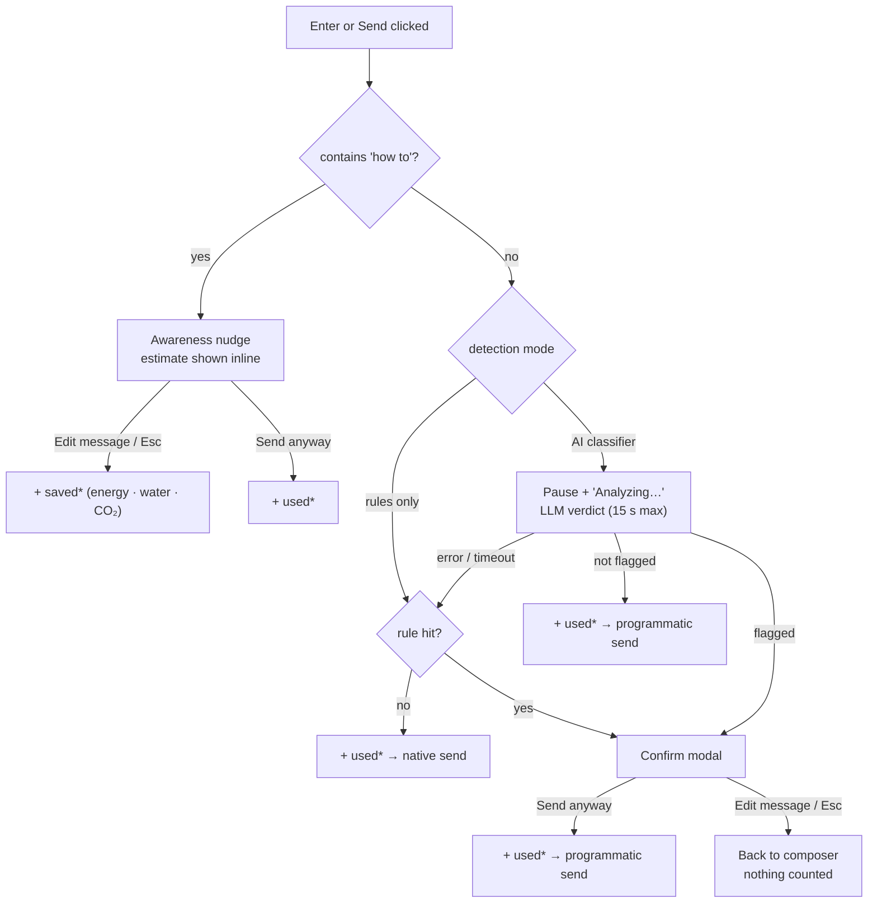
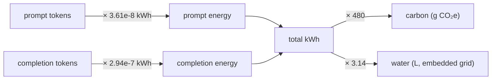

# ChatGuard — Resource tracking, explained

This document explains exactly how ChatGuard's **⚡ electricity**, **💧 water**
and **🌍 carbon** counters work — what they measure, what they don't, the
formulas behind them, and where the numbers come from.

> **Short version:** both counters are **estimates, not measurements**. There is
> no wattmeter between the extension and your machine. ChatGuard applies a
> transparent, published-data model to *how many tokens a message involves*.

---

## 1. The two counters

The popup shows two counters, each split into the same three metrics:

| | **Resource usage** | **Resources saved** |
| --- | --- | --- |
| Question it answers | "How much have the messages I actually sent cost (estimated)?" | "How much did I avoid by backing out of *how-to* queries?" |
| Computed by | `src/content/content.js` — `recordUsage()` | `src/content/content.js` — `editHowToMessage()` |
| Input | the message text | the message text |
| Trigger | every message **actually sent** (both modes) | a *how-to* query you **abandon** |
| Storage keys | `usageElectricityKwh`, `usageWaterL`, `usageCarbonG` | `savedElectricityKwh`, `savedWaterL`, `savedCarbonG` |

Both are read-modify-write on `chrome.storage.local`, so they persist across
browser restarts, and the popup's **Reset all** button zeroes all six.

### What is **not** counted

- A message you back out of with **Edit message** / <kbd>Esc</kbd> — nothing is
  counted (except a *how-to* query, which goes to **saved**).
- The extension's *own* classifier call to Ollama — that cost is deliberately
  excluded, so "usage" reflects *your* chatbot activity, not ChatGuard's.
- Rules-only mode counts exactly like AI-classifier mode: "usage" is incremented
  whenever the message goes through, regardless of how it was checked.

---

## 2. When each counter fires



Key idea: **used** fires on every path that ends with the message going out;
**saved** fires on exactly one path — abandoning a *how-to* query.

---

## 3. The estimation model

Both counters share one model in [`src/shared/impact.js`](src/shared/impact.js),
so a *saved* kilowatt-hour costs exactly as much as a *used* one.



$$ \text{kWh} = \text{promptTokens} \times 3.61\times10^{-8} \;+\; \text{completionTokens} \times 2.94\times10^{-7} $$

$$ \text{CO}_2\text{e (g)} = \text{kWh} \times 480 \qquad\qquad \text{water (L)} = \text{kWh} \times 3.14 $$

### Parameters and their sources

| Parameter | Default | Meaning | Source |
| --- | --- | --- | --- |
| `kWhPerPromptToken` | `3.61e-8` | ~0.13 J per prefill token | Solovyeva et al. (2026) — consumer-hardware measurement (RTX 4060) |
| `kWhPerCompletionToken` | `2.94e-7` | ~1.06 J per decode token | Same study; decode is ~8× prefill because it is memory-bandwidth bound |
| `carbonGPerKwh` | `480` | grams of CO₂e per kWh of electricity | Ember *Global Electricity Review* (2024) — world average; ~19.6 France, ~369 US, ~820 coal-heavy |
| `waterLPerKwh` | `3.14` | litres of water embedded in electricity generation per kWh | Li et al. (2023), *Making AI Less “Thirsty”* (range 3.14–6.01); local on-site cooling ≈ 0 |
| `assumedAnswerTokens` | `300` | assumed length of the chatbot's answer | ML.ENERGY benchmark typical (129–618); dominates every estimate |
| `charsPerToken` | `4` | rough tokeniser ratio for English text | ~4 characters per token; used to turn message text into prompt tokens |

---

## 4. Worked examples

### "how to dance" — a *saved* credit

| Step | Tokens | Energy |
| --- | --- | --- |
| prompt tokens | `ceil(12 ÷ 4) = 3` | `3 × 3.61e-8 = 1.083e-7 kWh` |
| assumed answer | `300` | `300 × 2.94e-7 = 8.82e-5 kWh` |
| **total** | `303` | **`8.831e-5 kWh` → ~0.09 Wh** |

Then:

- 🌍 carbon: `8.831e-5 × 480 ≈ 0.042 g CO₂e`
- 💧 water: `8.831e-5 × 3.14 ≈ 0.00028 L ≈ 0.28 mL`

### "hi" — a *used* credit

`2 chars → ceil(2 ÷ 4) = 1` prompt token + `300` assumed answer:

- energy: `1 × 3.61e-8 + 300 × 2.94e-7 = 8.824e-5 kWh` ≈ **0.09 Wh**
- carbon ≈ **0.04 g CO₂e**, water ≈ **0.28 mL**

> Because the assumed 300-token answer dominates, the message length only moves
> the result by a few mWh. That is an honest simplification, not a bug.

---

## 5. Display and units

`src/popup/popup.js` reads all six keys and formats them with the helpers in
`src/shared/impact.js`:

| Metric | Below threshold | Above threshold |
| --- | --- | --- |
| ⚡ electricity | `Wh` (below 1 kWh) | `kWh` |
| 💧 water | `mL` (below 1 L) | `L` |
| 🌍 carbon | `g CO₂e` (below 1 kg) | `kg CO₂e` |

---

## 6. Storage layout

| Key | Area | Written by | Purpose |
| --- | --- | --- | --- |
| `usageElectricityKwh`, `usageWaterL`, `usageCarbonG` | `local` | content script | used counters |
| `savedElectricityKwh`, `savedWaterL`, `savedCarbonG` | `local` | content script | saved counters |
| `enabled`, `useLLM`, `categories` | `sync` | popup | toggles |
| `localBaseUrl`, `localModel` | `local` | popup | classifier endpoint |

**Message text is never stored** — only the accumulated numbers above.

---

## 7. Honest limitations (read before the demo)

- **Not a meter.** These are order-of-magnitude estimates from published
  figures; the UI labels them `est.` for that reason.
- **Scope = your local model's incremental inference.** The modal's educational
  quotes cite large cloud models (e.g. "~0.5 L per GPT-3 query"); those include
  training amortisation and full data-centre overhead, which is a much larger
  scope than the counters.
- **Carbon is grid-dependent.** `480 gCO₂e/kWh` is a global average — ~19.6 in
  France, ~369 in the US, ~820 in coal-heavy regions.
- **Water = embedded grid water.** A local machine uses no on-site cooling
  water, so `waterLPerKwh = 3.14` models the water embedded in electricity
  generation (range 3.14–6.01; Li et al. 2023).
- **Answer length is assumed, not measured.** ChatGPT/Claude/Gemini don't expose
  their token counts to the page, so `assumedAnswerTokens = 300` (ML.ENERGY
  typical) stands in for the response length.
- **PUE is 1.0** for a local machine (no data-centre cooling overhead), so no
  PUE multiplier is applied.

### Recalibrating

Edit the `MODEL` object at the top of `src/shared/impact.js`. Both counters and
the nudge text update at once. Verify the model with:

```sh
node tests/impact.test.js
```

---

## 8. Research directions

The literature review also surfaced eight nudge-related research questions for
the project:

| # | Question | Hypothesis |
| --- | --- | --- |
| 1 | Micro-footprint disclosure | Precise but minuscule numbers (e.g. `0.04 g CO₂e`) trigger psychological discounting; cumulative/visual metrics (a “tree debt” that turns brown) change behaviour more. |
| 2 | Visualising uncertainty | Showing the error range of an *estimate* increases trust and lowers resistance to the nudge. |
| 3 | Geographic framing | “Depleting *your* local grid / water basin” is more persuasive than a global average. |
| 4 | Search vs ask vs think | Comparing the LLM query to a web search redirects factual queries but not generative ones. |
| 5 | Water vs carbon | Millilitres of drinking water evoke stronger affect than invisible grams of CO₂. |
| 6 | Equivalency design | Relatable metaphors (“= 1 LED hour”, “= 1 phone charge”) outperform Joules/kWh; test via multi-armed bandit. |
| 7 | Babbling suppression | A “stop generating to save energy” button saves decode energy but may weaken the user's emotional bond with the chatbot. |
| 8 | Jevons paradox of local execution | “Local is greener” may induce a rebound effect: total local energy exceeds prior cloud usage. |

## 9. Files involved

| File | Role |
| --- | --- |
| `src/shared/impact.js` | the shared model: `estimateImpact`, `estimatePromptTokens`, `format.*` |
| `src/content/content.js` | `recordUsage()` / `sendSafely()` (used) and `editHowToMessage()` (saved) |
| `src/background/service-worker.js` | LLM classification only — **does not** touch counters |
| `src/popup/popup.js` + `popup.html` | read and display the six keys; **Reset all** |
| `tests/impact.test.js` | unit tests for the model and formatters |
